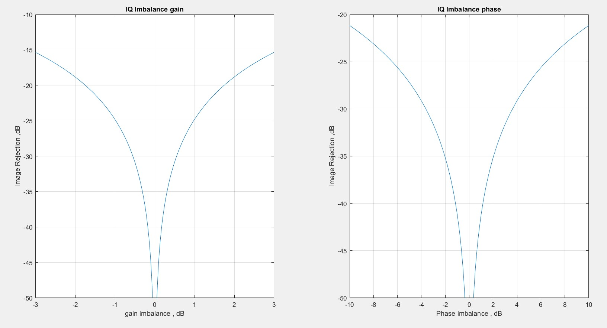
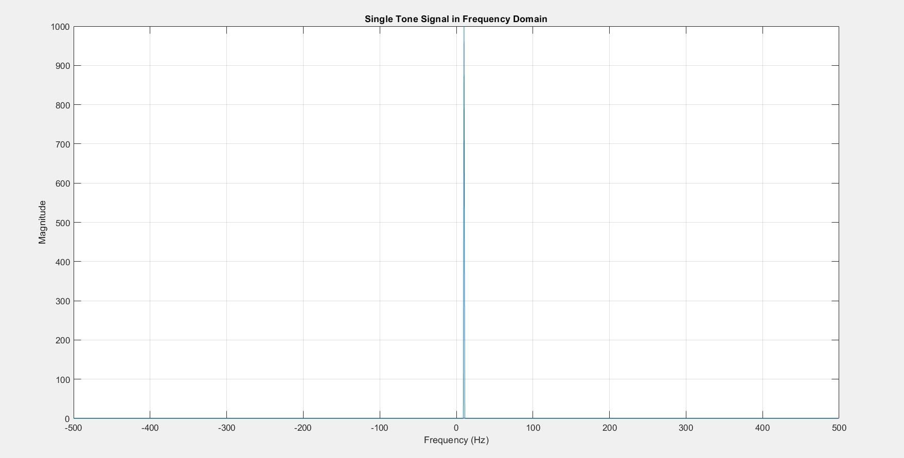
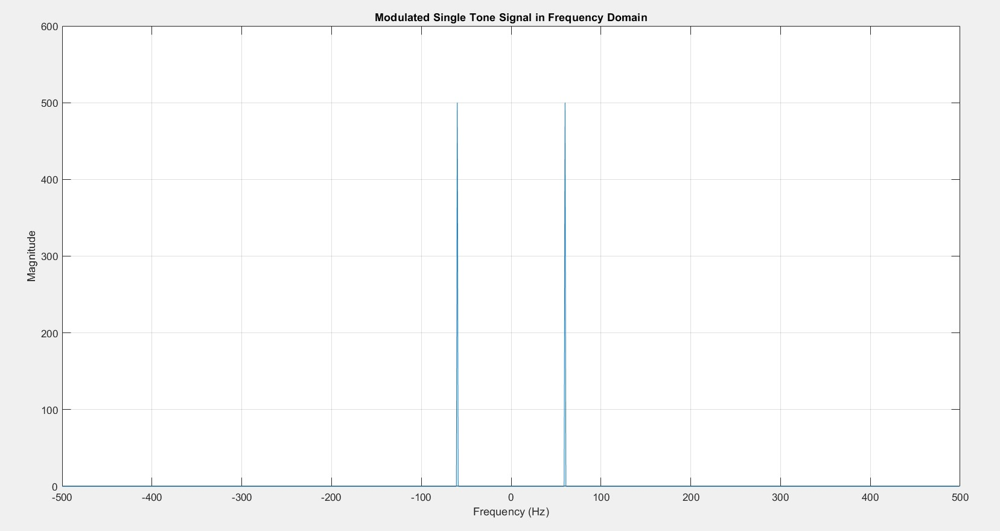
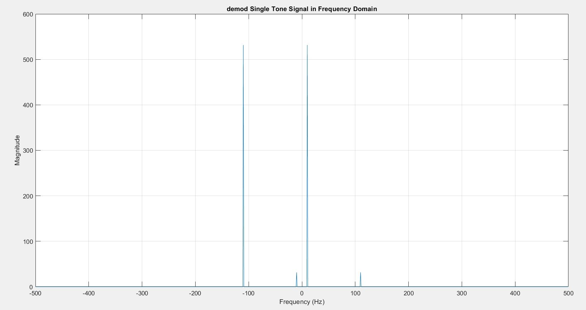
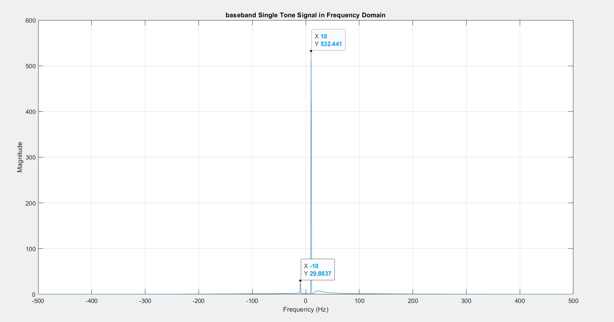
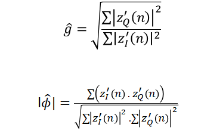
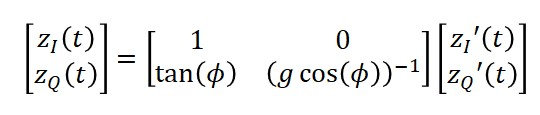
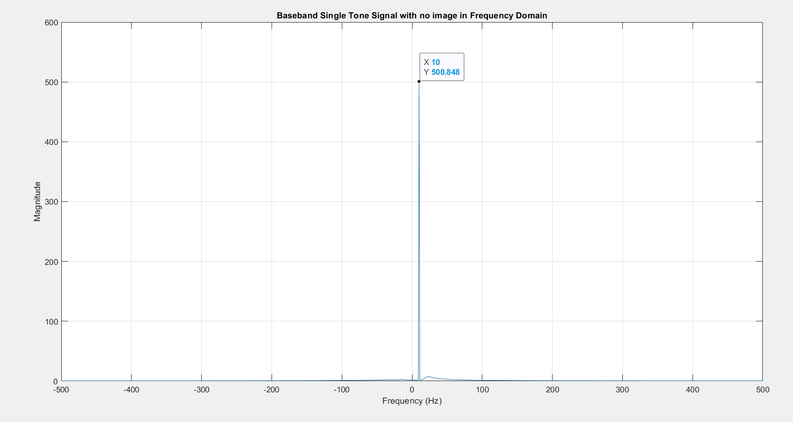

# IQ-imbalance-and-QEC-algorithm
## Table of Contents
- [IQ-imbalance-and-QEC-algorithm](#iq-imbalance-and-qec-algorithm)
  - [Table of Contents](#table-of-contents)
  - [Introduction](#introduction)
  - [IQ Imbalance Gain or Phase Imbalance](#iq-imbalance-gain-or-phase-imbalance)
  - [Modulation and Deomdulation](#modulation-and-deomdulation)
    - [Modulation of single tone](#modulation-of-single-tone)
    - [Demodulation of the signal](#demodulation-of-the-signal)
    - [Getting The Baseband Signal](#getting-the-baseband-signal)
  - [Signal Recovery without IQ Imbalance](#signal-recovery-without-iq-imbalance)
## Introduction
A typical IQ (In-phase and Quadrature) modulation and demodulation system, commonly used in communication systems, particularly in radio frequency (RF) applications.

In practical systems, imperfections in the hardware (such as mismatched gains in the I and Q paths or phase errors) can result in a distorted signal, which can lead to reduced system performance, such as image rejection ratio (IRR) degradation.

## IQ Imbalance Gain or Phase Imbalance
The imbalance between the I (In-phase) and Q (Quadrature) components is computed by either varying the phase or the gain, and then the image rejection is calculated using the Fast Fourier Transform (FFT).



Both plots highlight how IQ imbalances degrade the system's performance by reducing the IRR. The closer the gain and phase are to perfect balance (zero imbalance), the better the image rejection, leading to higher IRR values and a cleaner signal output. The symmetric shape of the curves reflects that imbalances in either direction lead to a performance drop.

## Modulation and Deomdulation
### Modulation of single tone
``` matlab
fm = 10;  % Frequency in Hz (single tone)
fs = 1000;  % Sampling frequency in Hz
t = 0:1/fs:1-1/fs;  % Time vector from 0 to 1 second

% Complex signal in time domain
signal = exp(1j*2*pi*fm*t);
```


After Generation of the single tone Signal,It is then multiplied by a carrier of Frequency equals 50Hz

``modulated_signal=real(signal).*cos(2*pi*fc*t)-imag(signal).*sin(2*pi*fc*t);``



### Demodulation of the signal
Then it is required to Demodulated the signal taking into considration the IQ imbalance, Here assumed the gain_Imbalance equals 1dB.

``` matlab
phi=0;
g=1.1266;
demodulated_signal_1 = modulated_signal.*cos(2*pi*fc*t);
demodulated_signal_2 = modulated_signal.*(-1*g*sin(2*pi*fc*t+phi));
demod = demodulated_signal_1+1j*demodulated_signal_2;
```



**NOTE: The figure shows the image of the signal at -fm which has IRR of 25dB**

### Getting The Baseband Signal
Then the demodulated signal is then passed by a LPF to acuire the Baseband Signal

``` matlab
cutoff_freq = 20;  % Cutoff frequency for the LPF (slightly above fm)
[b, a] = butter(5, cutoff_freq/(fs/2));  % 5th order Butterworth filter
% Apply the low-pass filter
I_filtered = filtfilt(b, a, demodulated_signal_1);  % Filtered in-phase component
Q_filtered = filtfilt(b, a, demodulated_signal_2);  % Filtered quadrature component
baseband_signal = I_filtered + 1j * Q_filtered;
```


you can re-estimate the gain and phase imbalance using these formulas


## Signal Recovery without IQ Imbalance
To Remove the effect of the image,The Imbalance Signal is multiplied by the inverted transformation of the IQ imbalance



``` matlab
inv_g=1/g;
rejected_image_signal= I_filtered + 1j*inv_g*Q_filtered;
```

